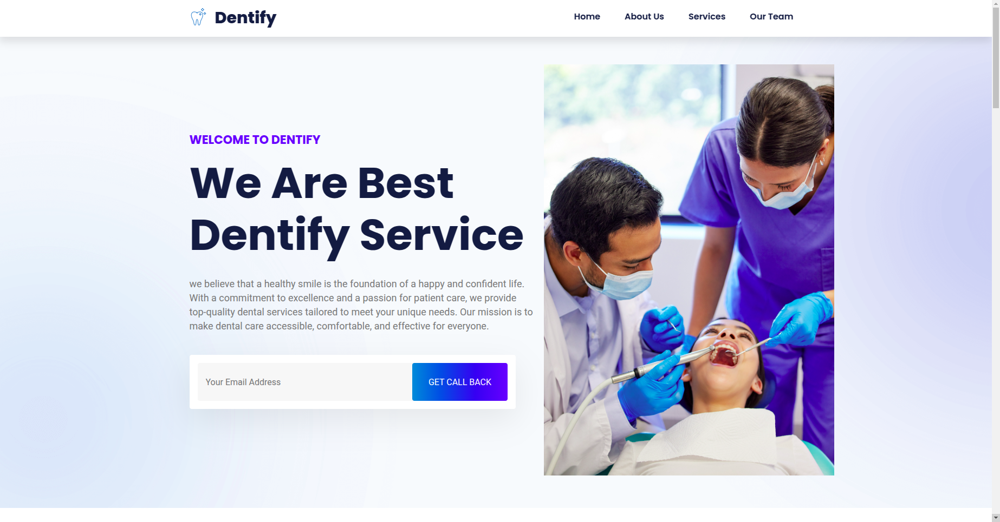
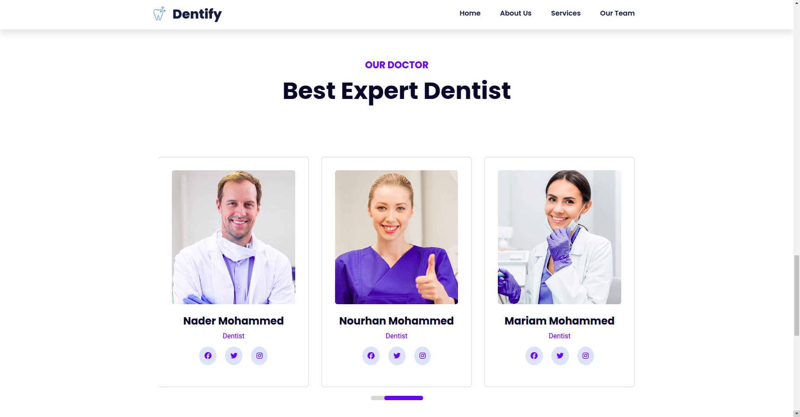
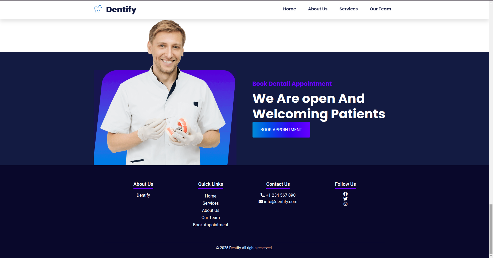

# 🦷 Dentify – Dental Clinic Website  

## 📌 Overview  
**Dentify** is a modern, responsive **dental clinic website** designed to provide a seamless experience for patients. The website offers an elegant design, intuitive navigation, and essential features for a dental practice.  

## ✨ Features  
- ✅ **Home Page:** A welcoming section with an overview of services.  
- ✅ **About Us:** Information about the clinic and staff.  
- ✅ **Services:** Detailed descriptions of dental treatments offered.  
- ✅ **Appointments:** Allows users to book appointments online.  
- ✅ **Contact Page:** Includes a contact form, clinic location, and working hours.  
- ✅ **Fully Responsive:** Works on all devices (desktop, tablet, mobile).  

## 🛠 Technologies Used  
- **HTML5**  
- **CSS3**  
- **JavaScript (ES6+)**  
- **Bootstrap**  
##📸 Screenshots

